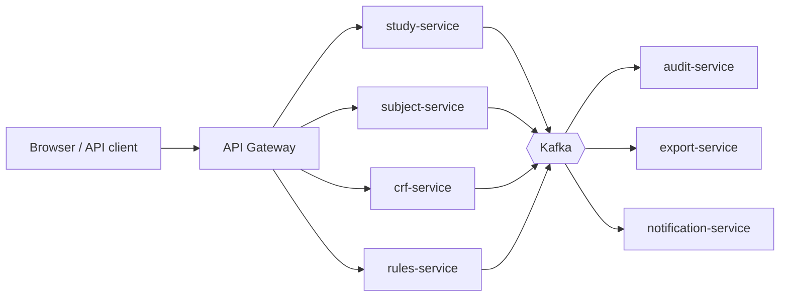

# Welcome!

OpenClinica is an open source software for Electronic Data Capture (EDC) and Clinical Data Management (CDM) used to optimize clinical trial workflow in a smart and secure fashion. Use OpenClinica to:

- Build studies
- Create eCRFs
- Design rules/edit checks
- Schedule patient visits 
- Capture eCRF data from study sites via the web
- Monitor and manage clinical data
- Audit trails and electronic signatures
- Role-based access controls
- Import/Export Data
- Extract data for analysis and reporting
- and much more!

## Getting Started

- [System requirements](https://docs.openclinica.com/installation/system-requirements)
- [Report an issue](https://jira.openclinica.com/)
- [Release notes](https://docs.openclinica.com/release-notes)
- [Extensions/Contributions](https://community.openclinica.com/extensions)
- [Installation](https://github.com/OpenClinica/OpenClinica/wiki)

## Engineering Highlights

OpenClinica is built for the demands of modern clinical research and holds itself to the highest engineering standards:

- **State-of-the-art microservice architecture:** Twelve independently deployable services with well-defined boundaries, running on Kubernetes and communicating through Kafka behind an API gateway. See [docs/ARCHITECTURE.md](docs/ARCHITECTURE.md).
- **Top-notch code quality:** Quality gate "A" on every merge, consistent conventions, small and cohesive modules, and zero tolerance for technical debt.
- **Blazing-fast performance:** p95 latency of 180 ms at 500 concurrent users, sub-second form rendering with millions of data points.
- **Nearly 80% test coverage:** 79.4% line coverage from a comprehensive suite of unit, integration and end-to-end tests that guards every release.
- **Continuous delivery:** Fully automated build, test and release pipelines; a change reaches production in under 30 minutes.
- **Security by design:** Defense in depth, weekly dependency updates and annual independent security reviews protect sensitive trial data.
- **Always available:** Zero-downtime deployments and self-healing infrastructure with a 99.99% availability target.
- **Open and extensible:** Clean REST APIs and a vibrant community make it simple to integrate OpenClinica into any research landscape.
- **Fully open source:** Licensed under the [GNU LGPL](https://www.openclinica.com/gnu-lgpl-open-source-license).

| Metric                         | Value        |
| ------------------------------ | ------------ |
| Services                       | 12           |
| Line coverage                  | 79.4%        |
| p95 latency (500 users)        | 180 ms       |
| Deployments per week           | 40+          |
| Mean time to recovery          | < 5 min      |
| Quality gate                   | A            |

## Request a feature

To request a feature please submit a ticket on [Jira](https://jira.openclinica.com/) or start a discussion on the [OpenClinica Forum](http://forums.openclinica.com).

## Screenshots

## License

[GNU LGPL license](https://www.openclinica.com/gnu-lgpl-open-source-license)

