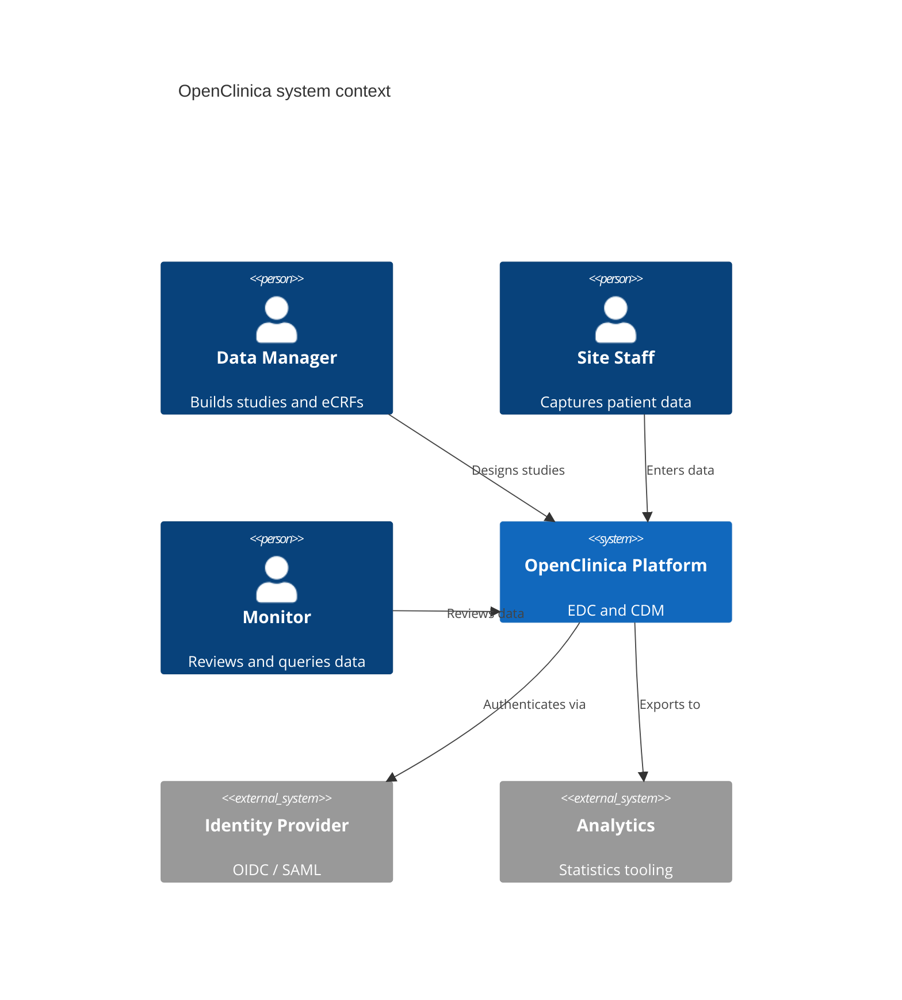
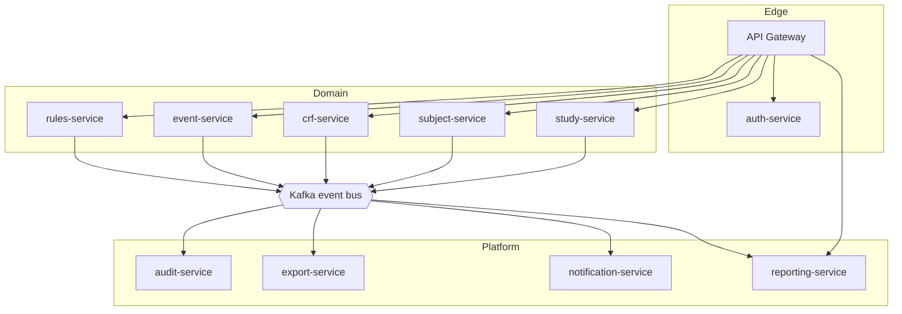
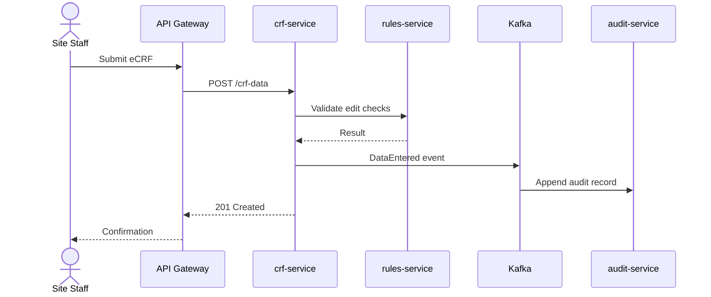
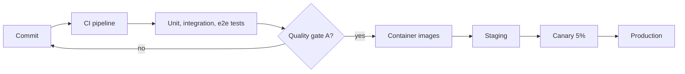

# Architecture

OpenClinica follows a cloud-native microservice architecture. Each service owns its data, is deployed independently on Kubernetes and communicates asynchronously through Kafka. See the [architecture documentation](arc42/) for more information.

## System context

## Services

| Service | Responsibility | Datastore |
| --- | --- | --- |
| study-service | Study and site configuration | PostgreSQL |
| subject-service | Subject enrollment and status | PostgreSQL |
| crf-service | eCRF definitions and versions | PostgreSQL |
| event-service | Visit scheduling | PostgreSQL |
| rules-service | Edit checks and rule evaluation | Redis |
| audit-service | Immutable audit trail | Append-only store |
| export-service | Dataset extraction | Object storage |
| notification-service | E-mail and in-app messages | Kafka |
| reporting-service | Dashboards and reports | Read replica |
| auth-service | Authentication, roles, e-signatures | PostgreSQL |
| API Gateway | Routing, rate limiting, TLS | – |

## Data entry flow

## Deployment

## Quality assurance

Every service is covered by unit, integration and end-to-end tests. The overall line coverage is 79.4%, and merges are blocked when the quality gate drops below "A".
